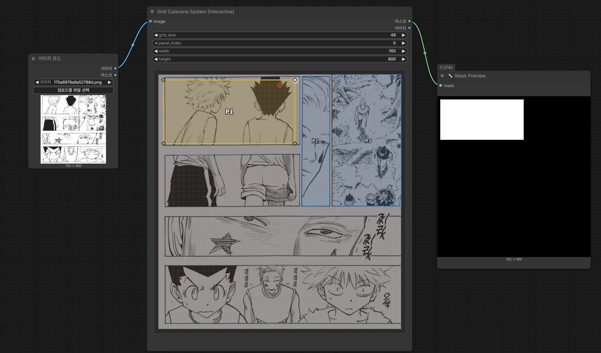

# comfyui-grid-cutscene

ComfyUI 커스텀 노드: **Grid Cutscene System (Interactive)**

격자(grid) 위에서 패널 단위로 4개의 포인트를 찍어 폴리곤 마스크를 만들고, 이를 `MASK`와 미리보기용 `IMAGE`로 출력하는 노드입니다.

## 설치

1) 폴더를 아래 경로로 복사

`ComfyUI/custom_nodes/comfyui-grid-cutscene`

2) 의존성 설치 (ComfyUI Portable 루트 기준)

```bat
python_embeded\python.exe -m pip install -r ComfyUI\custom_nodes\comfyui-grid-cutscene\requirements.txt
```

3) ComfyUI 실행

## 노드 정보

- **표시 이름**: Grid Cutscene System (Interactive)
- **클래스**: `GridCutscenePanel`
- **카테고리**: `LayoutTools`

## 사용 방법

1) `grid_size`를 설정 (예: `12`)
2) `panel_index` 선택 (`0..7`)
3) 그리드 위를 클릭해서 포인트를 찍습니다.
4) 포인트가 4개가 되면 폴리곤 마스크가 생성됩니다.

`all_panels_data`는 내부(히든 위젯)에 저장되며, 마스크를 재구성할 때 사용됩니다.

## 입력/출력

### 출력

- `MASK`
- `IMAGE` (마스크를 3채널 이미지로 변환한 미리보기)

## 샘플

아래 이미지는 저장소에 포함된 샘플입니다.



## 트러블슈팅

- **노드가 목록에 안 보임**
  - 폴더 경로가 `ComfyUI/custom_nodes/comfyui-grid-cutscene`인지 확인하세요.
  - ComfyUI를 재시작하세요.
- **의존성 설치 오류**
  - `requirements.txt` 설치 명령을 ComfyUI Portable 루트에서 실행했는지 확인하세요.

## License

MIT
